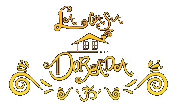

<h1>
     
    

        
         
        Golden House Management App
    

</h1>

 

## **About**
This app was build in order to make easier the process of manage products, orders, clients and employees of *La Casa Dorada*. The app in this repository is an **Eclipse project** developed using 
[Java 1.8](https://www.oracle.com/co/java/technologies/javase/javase-jdk8-downloads.html), 
[JavaFX](https://openjfx.io/), 
[SceneBuilder](https://gluonhq.com/products/scene-builder/), 
[JfoeniX](https://github.com/sshahine/JFoenix),  
[FontAwesomeFX 1.3.0](https://github.com/Jerady/fontawesomefx-glyphsbrowser) and
[CSS](https://developer.mozilla.org/en-US/docs/Web/CSS).

## **Features**
The app is able to:
- Create ingredients, products, clients, orders, employees and users.
- Modify ingredients, products, clients, orders, employees and users.
- Generarte csv reports of products, orders and employees.
- Import a csv file of ingredients, products, clients or orders.

Remember, every single change will be saved in the app internal files.

If you are interested in the way of how the app works and do all this functionalities we invite you to read the file at docs *Functional Requierements and Class Diagram.pdf*

## **Modications V.2**
[Click here](https://drive.google.com/file/d/1Ym6CQwmoDw_-he0uDv6N-FC929ZDvG_X/view?usp=sharing) to download the modifications of the app.
